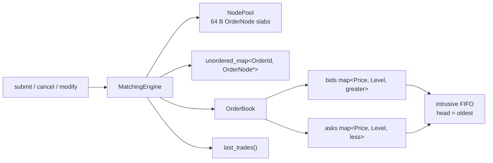

# cpp-limit-order-book

A single-instrument limit-order-book matching engine in C++23: integer-tick
prices, intrusive FIFO levels, O(1) order-id cancel, and a slab allocator so
the hot path does not `new` per order. Written to be read in an interview, not
to be a full exchange.

## Architecture



Price-time priority: best price first (`map::begin()`), time via FIFO at the
level. Trades print at the **maker** price. See [DESIGN.md](DESIGN.md) for
Big-O, cache rationale, a lock-free sketch, and multi-instrument routing.

## Build

Requires CMake 3.24+, a C++23 compiler (GCC 14 / Clang 18 are known-good), and
Ninja. GoogleTest and Google Benchmark are pulled with FetchContent.

```bash
cmake --preset default
cmake --build --preset default
ctest --preset default --output-on-failure
```

Sanitizers:

```bash
cmake --preset asan
cmake --build --preset asan
ctest --preset asan --output-on-failure
```

## Tests

```bash
./build/lob_tests
```

The suite covers limit/market matching, partial fills, FIFO at a level,
price-time across levels, cancel (including middle-of-queue), modify (qty-down
keeps priority, qty-up loses it, aggressive price takes), and the invariant
that the book never rests a crossing order.

## Benchmarks

Two targets:

```bash
./build/lob_harness 200000          # median / p95 / p99, ops/sec, memory estimate
./build/lob_bench                   # Google Benchmark
```

Measured on this repo's build box, **not** a claim about production colocated
hardware. Reproduce with the commands above; do not treat the table as a spec.

| Host | CPU | OS | Compiler | Flags |
|---|---|---|---|---|
| KVM guest, 8 cores | Intel Xeon (hypervisor) | Debian 13 | g++ 14.2 | `-O3`, Ninja, 2026-08-26 |

`n = 200000`, `std::chrono::steady_clock` around each operation after a short
pool warmup. `mem KB` is an internal estimate (pool slabs + hash + tree nodes),
not process RSS.

| workload | n | ops/sec | median ns | p95 ns | p99 ns | mem KB | resting |
|---|---:|---:|---:|---:|---:|---:|---:|
| rest_no_cross | 200000 | 8,613,155 | 74.0 | 96.0 | 140.0 | 17292 | 200000 |
| cancel | 200000 | 17,507,541 | 53.0 | 67.0 | 135.0 | 14127 | 0 |
| cross_full_fill | 200000 | 20,001,576 | 48.0 | 55.0 | 73.0 | 14127 | 0 |
| mixed_70_20_10 | 200000 | 14,759,138 | 56.0 | 84.0 | 113.0 | 7954 | 80000 |

Workloads: rest only (bids/asks separated so nothing crosses); cancel the
resting set; every submit fully fills against a pre-seeded opposite book;
mixed 70% rest / 20% cancel / 10% market.

## Data structures

| Piece | Structure | Why |
|---|---|---|
| Order | `alignas(64) OrderNode` | one cache line, intrusive links |
| Allocation | `NodePool` free-list of slabs | no per-order heap on the hot path |
| Level | doubly-linked FIFO | O(1) cancel given the node |
| Prices | `std::map` best-first | sparse P, O(1) BBO, stable node addresses |
| Id lookup | `unordered_map<OrderId, OrderNode*>` | O(1) cancel / modify |
| Errors | `std::expected` | no exceptions on submit/cancel/modify |

Vs. `std::map<Price, std::deque<Order>>`: a deque cannot cancel in O(1)
without storing iterators (which invalidate), allocates in chunks, and copies
`Order` values. The intrusive node + pool is more code and better behaved
under cancel-heavy flow. A tick-indexed `vector<PriceLevel>` would be faster
still for a tight dense range; it is the wrong default for a wide book.

## Limitations

- One instrument, one thread. Not safe to share a `MatchingEngine`.
- Limit (GTC) and market only. No IOC/FOK, iceberg, stop, or hidden.
- No self-trade prevention, no accounts, no fees, no tick/lot table.
- No journal / snapshot / recovery.
- Modify qty-up or price change **loses** time priority (documented, tested).
- `last_trades()` is overwritten by the next mutating call.
- Hash lookup is amortized O(1); a degenerate table is still a hash table.

MIT licensed. Design discussion lives in [DESIGN.md](DESIGN.md).
